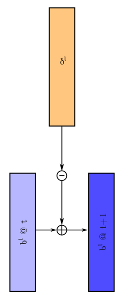
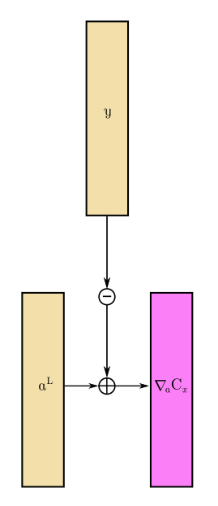

Visuals for Nielsen's online textbook
=====================================

I was inspired by Michael Nielsen's superb [Neural Networks and Deep Learning](http://neuralnetworksanddeeplearning.com/),
particularly Chapter 2, [How the backpropagation algorithm works](http://neuralnetworksanddeeplearning.com/chap2.html),
to put together some visuals to assist in following along with his derivations
of the backpropagation equations, especially BP1a-BP4.

*Note: These visuals present a matrix view of the forward propagation and 
backpropagation in the neural net. This is a low-level view of essentially what 
is happening in a "typical" ML framework but doesn't necessarily correspond to
the exact details as every framework will implement the details in a slightly
different way.*

To start with, here is a diagram depicting a single feed-forward layer using
Nielsen's notation:

Here is how the layers connect together, with a training sample on the left
and the mean-squared error (C) on the right:

Here is a diagram showing how the delta values chain from one layer to the 
previous layer:

After the delta vector for the current layer has been calculated, we can use
this to update the weights, as depicted here:

Similarly, we use the delta vector to update the biases, as depicted here:

Because we use the gradient to train the neural net, we do not actually need
to calculate the loss (cost) of the outputs directly. Instead, the gradient of 
the mean-squared error of the output layer activations is calculated without
calculating the cost itself, as shown here:

