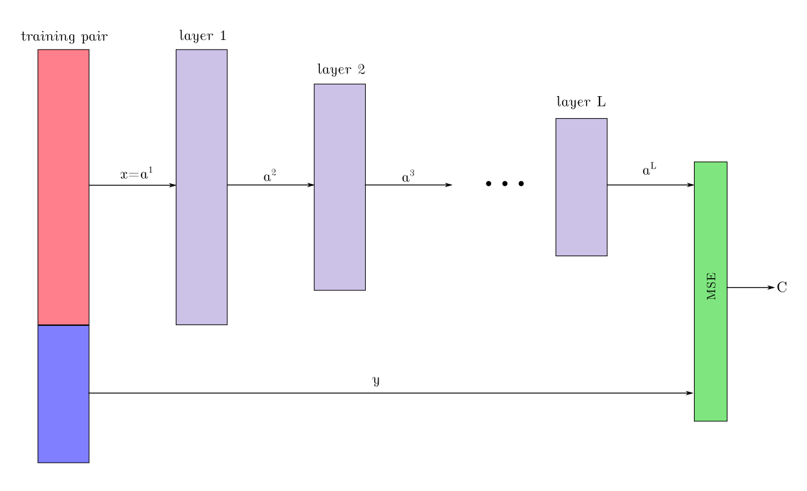

Visuals for Nielsen's online textbook
=====================================

I was inspired by Michael Nielsen's superb [Neural Networks and Deep Learning](http://neuralnetworksanddeeplearning.com/),
particularly Chapter 2, [How the backpropagation algorithm works](http://neuralnetworksanddeeplearning.com/chap2.html),
to put together some visuals to assist in following along with his derivations
of the backpropagation equations, especially BP1a-BP4.

To start with, here is a diagram depicting a single feed-forward layer using
Nielsen's notation:

Here is how the layers connect together, with a training sample on the left
and the mean-squared error (C) on the right:

Finally, here is a diagram showing how the delta values chain from one layer
to the previous layer:

